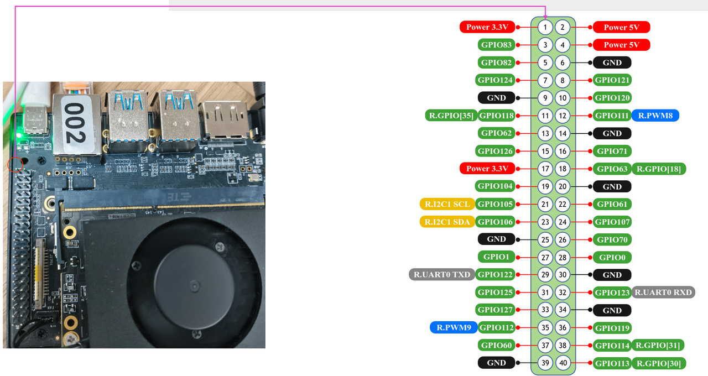
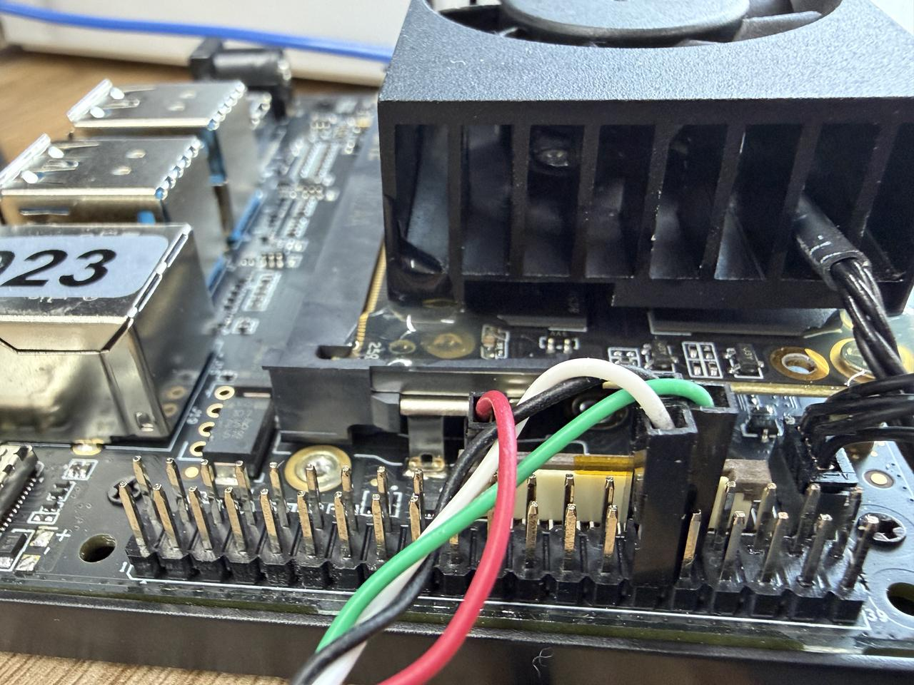
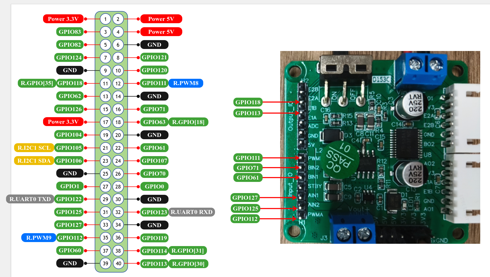

# RT-Thread 差速小车电机控制

基于 RT-Thread 和 Spacemit K3 平台的双电机差速控制系统，当前实现重点为双电机闭环调速与大小核 RPMsg 异步通信。

## 功能特性

- ✅ 双电机独立 PWM 调速控制
- ✅ GPIO 控制电机正反转方向
- ✅ 霍尔编码器脉冲计数 (GPIO 中断)
- ✅ 实时转速计算（单位：r/s，内部调试常换算为 mr/s）
- ✅ 前馈 + PID 闭环控制
- ✅ RPMsg 大小核异步通信
- ✅ MSH 命令行控制接口
- ✅ 可配置反馈周期与反馈开关
- ✅ Linux 端异步接收状态并按频率摘要打印


## 引脚映射




## 调试串口连接




## 硬件配置及接线



### 电机（左） 1

| 功能        | 引脚                         | 说明      |
| ----------- | ---------------------------- | --------- |
| 方向控制 0  | GPIO 125 -> AIN2             | H 桥控制  |
| 方向控制 1  | GPIO 127 -> AIN1             | H 桥控制  |
| PWM         | rpwm9 (GPIO 112) -> PWMA     | 10KHz PWM |
| 编码器 A 相 | GPIO 113（R.GPIO[30]）-> E1A | 中断输入  |

### 电机 （右）2

| 功能        | 引脚                         | 说明      |
| ----------- | ---------------------------- | --------- |
| 方向控制 0  | GPIO 71 -> BIN2              | H 桥控制  |
| 方向控制 1  | GPIO 61 -> BIN1              | H 桥控制  |
| PWM         | rpwm8 (GPIO 111) -> PWMB     | 10KHz PWM |
| 编码器 A 相 | GPIO 118（R.GPIO[35]）-> E1B | 中断输入  |

### 编码器参数

- PPR (每转脉冲数): 11
- 减速比: 30


## 项目结构

```
rt-diff-motor-control/
├── control_main.c          # 主程序入口，初始化和底盘控制线程
├── include/
│   ├── common.h            # 引脚定义和通用参数
│   ├── encoder.h           # 编码器接口
│   ├── motor_control.h     # 电机控制接口
│   ├── motor_gpio.h        # GPIO 方向控制接口
│   ├── motor_pwm.h         # PWM 控制接口
│   ├── pid.h               # PID 控制器接口
│   └── rpmsg_motor.h       # RPMsg 电机控制接口
├── src/
│   ├── encoder.c           # 编码器脉冲计数与速度计算线程
│   ├── led_test.c          # LED 测试命令
│   ├── motor_control.c     # 电机控制和 MSH 命令
│   ├── motor_gpio.c        # 电机方向 GPIO 控制
│   ├── motor_pwm.c         # PWM 驱动封装
│   ├── pid.c               # PID 控制器实现
│   ├── rpmsg_motor.c       # RPMsg 电机控制服务与反馈线程
│   └── rpmsg_test.c        # RPMsg 测试程序
├── k3_src/
│   └── rpmsg_motor_async.c # Linux 端 RPMsg 客户端
└── examples/               # 示例代码
```

## 通信协议 (RPMsg)

大核 (Linux) 与小核 (RCPU) 之间通过 RPMsg 异步通信。

- 服务名：`rpmsg:motor_ctrl`
- RCPU 源地址：`1002`
- Linux 源地址：`1003`
- 默认反馈周期：`20ms`（约 `50Hz`）

### 命令格式

| 方向 | 命令 | 格式 | 示例 |
|------|------|------|------|
| 大核→小核 | CFG | `CFG,ratio,ff,kp,ki,kd[,feedback_enable]` | `CFG,30,0.3,0.05,0.2,0.01,1` |
| 大核→小核 | 速度指令 | `dir1,speed1;dir2,speed2` | `1,2.0;1,2.0` |
| 小核→大核 | 状态反馈 | `dir1,speed1_mrs;dir2,speed2_mrs` | `1,2000;1,1980` |

说明：

- `dir`：`0=停止`，`1=正转`，`2=反转`
- `speed`：单位为 `r/s`
- `speed*_mrs`：单位为 `mr/s`（毫转每秒）
- `feedback_enable`：可选，`0=关闭反馈`，`1=开启反馈`
- `ratio` / `ff` / `kp` / `ki` / `kd` 由小核接收后立即更新到底盘控制参数


## Linux 端使用

### 编译

```bash
cd bsp/spacemit/applications/rt-diff-motor-control/k3_src
gcc -o rpmsg_motor_async rpmsg_motor_async.c -lpthread -lm
```

### 运行

```bash
./rpmsg_motor_async
```

Linux 端程序会启动一个接收线程，持续接收小核反馈，并且：

- 收到普通状态消息时，按批次打印：`[Feedback] ...`
- 收到非预期格式消息时，打印：`[Linux] Recv: ...`


## MSH 命令 (小核)

### 速度控制
```bash
# 格式: cmd_speed <dir1,speed1>;<dir2,speed2>
# dir: 0=停止, 1=正转, 2=反转
# speed: 转/秒 (r/s)

cmd_speed 1,2.0;1,2.0     # 双电机正转 2.0 r/s
cmd_speed 0,0;0,0         # 停止双电机
cmd_chassis_stop          # 紧急停止
```

### RPMsg 反馈控制
```bash
cmd_rpmsg_feedback on     # 启用反馈
cmd_rpmsg_feedback off    # 禁用反馈
cmd_rpmsg_feedback 50     # 设置反馈间隔 (ms)
```

### 调试命令
```bash
enc_info                  # 读取编码器 delta 和速度
```

## 系统线程

| 线程名 | 频率 | 功能 |
|--------|------|------|
| enc1/enc2 | 约 20Hz | 读取编码器 delta，计算速度 |
| chassis | 50Hz | PID 控制，里程计更新 |
| rpmsg_fb | 50Hz | 发送状态/里程计反馈 |

补充说明：

- `control_main.c` 中底盘控制线程实际通过 `rt_thread_mdelay(20)` 运行，周期约 `20ms`，即约 `50Hz`
- `src/rpmsg_motor.c` 中反馈线程默认也是 `20ms`
- 当前代码反馈内容是**电机状态**，不是里程计

## 编译 (小核)

项目源文件在 `bsp/spacemit/applications/SConscript` 中注册：

替换为如下内容

```python
Import('RTT_ROOT')
Import('rtconfig')
from building import *
import os

cwd     = GetCurrentDir()

# BSP spacemit 目录
bsp_spacemit_dir = os.path.dirname(cwd)

# 使用 rt-diff-motor-control 中的源文件
src     = [
    'rt-diff-motor-control/control_main.c',
    'rt-diff-motor-control/src/motor_pwm.c',
    'rt-diff-motor-control/src/motor_gpio.c',
    'rt-diff-motor-control/src/encoder.c',
    'rt-diff-motor-control/src/motor_control.c',
    'rt-diff-motor-control/src/led_test.c',
    'rt-diff-motor-control/src/pid.c',
    'rt-diff-motor-control/src/rpmsg_test.c',
    'rt-diff-motor-control/src/rpmsg_motor.c',
]
CPPPATH = [
    GetCurrentDir(),
    GetCurrentDir() + '/rt-diff-motor-control/include',
]

CCFLAGS = ' -c -ffunction-sections'

group   = DefineGroup('Applications', src, depend = [''], CPPPATH = CPPPATH, CCFLAGS=CCFLAGS)

Return('group')
```

```
cd esos
./build_top.sh config # 选择 rt24
./build_top.sh
```


## 更新小核

```
scp update_esos.sh remote_board@ip:~/
```

在远程主机使用

```
bash update_esos.sh host_pc@pc_ip:/path/to/esos_output
```

`/path/to/esos_output`里面应该有：

```
esos.itb  rt24_os0_rcpu.elf  rt24_os1_rcpu.elf
```

## 当前串口/终端打印说明

当前工程里常见的循环打印主要分两类：

### 1. 小核串口打印

- `src/rpmsg_motor.c`
    - 接收到命令时打印：`[rpmsg_motor] Recv: ...`
    - 初始化时打印端点创建和线程启动信息
- `src/encoder.c`
    - 编码器线程启动、异常、信息查询相关打印
- `control_main.c`
    - 目标速度更新、配置更新、初始化日志

### 2. Linux 终端打印

- `k3_src/rpmsg_motor_async.c`
    - 接收线程中批量打印 `[Feedback] ...`
    - 若收到无法解析的内容，则直接打印 `[Linux] Recv: ...`

当出现“终端循环打印”时，通常是：

- Linux 端正在持续接收小核反馈；或
- 上位机在持续发送速度命令，导致小核 `Recv` 日志不断输出。

`motor_model.c` 中实现了基于线性拟合的前馈模型：

```
duty = k * speed + b
```

正转和反转使用不同的 k、b 参数，通过实际测量标定得到。

## License

MIT
